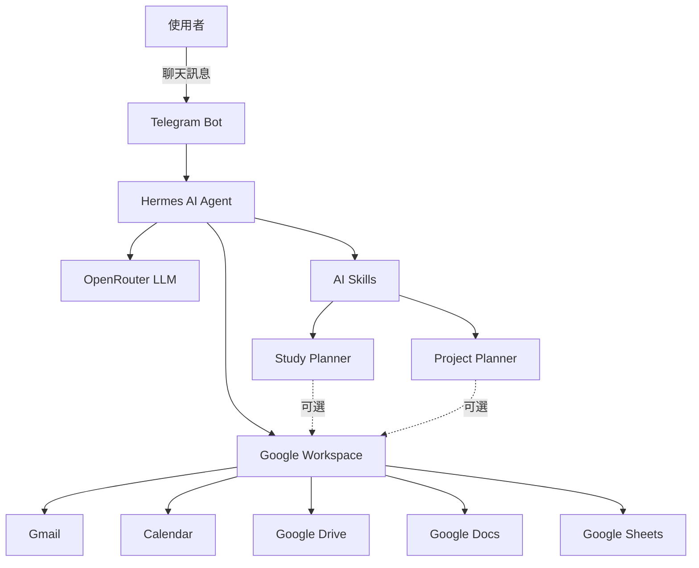

# AI-Agent-Learning
## 專案介紹
這是我根據YT教學影片學習如何用Hermes創建自己的AI Agent的實作專案。
除了完成課程內容外，我也整理了安裝流程、問題排除、自訂 AI Skills與學習心得，希望作為未來持續擴充 AI Agent 的基礎。

## 系統架構圖


## 專案目標
- 學習Hermes AI Agent的使用方法
- 串接OpenRouter作為大型語言模型
- 串接Telegram Bot與AI Agent對話
- 串接Google Workspace
- 設計自訂AI Skill

## 使用工具
| 工具 | 說明 |
|------|------|
| Hermes Agent | AI Agent Framework |
| OpenRouter | LLM 平台 |
| Google Workspace API | 提供Gmail、Calendar、Docs、Drive等工具串接 |
| Telegram | 對話介面 |
| Windows PowerShell | 執行環境 |

## 專案功能

### Google Workspace

- 讀取Gmail郵件
- 建立Google Calendar行程
- 搜尋Google Drive檔案
- 建立Google Docs文件
- 建立Google Sheets試算表

### Study Planner Skill

提供每週讀書計畫。

功能包含:

- 整理待辦事項
- 安排一週讀書計畫
- 產生每日讀書進度
- 依截止日期安排優先順序
- 整理本周完成與未完成事項
- 可建立Google Calendar、Google Docs、Google sheet

### Project Planner Skill

協助規劃專題開發流程。

功能包含:

- 收集專題資訊
- 拆解Milestone
- 安排每週進度
- 建立甘特圖
- 專題進度追蹤
- 可建立Google Calendar、Google Docs、Google sheet

## 專案結構

```
AI-Agent-Learning
│
├── README.md
├── docs
│   ├── installation.md
│   ├── development-log.md
│   ├── study-planner-prompt.md
│   ├── project-planner-prompt.md
│   └── problems.md
│
└── images
```

## 文件說明

| 文件 | 說明 |
|------|------|
| installation.md | 安裝與環境建置流程 |
| development-log.md | 開發紀錄 |
| study-planner-prompt.md | Study Planner Prompt |
| project-planner-prompt.md | Project Planner Prompt |
| problems.md | 遇到問題紀錄 |

## 功能展示

>**Telegram對話**


>**Study Planner成果**


>**Project Planner成果**


>**Google Sheet、Google Calendar建立**


## 心得與學習收穫

透過本專案，我學習了Hermes AI Agent的基本操作流程，包含OpenRouter、Telegram Bot與Google Workspace的串接方式。

在開發過程中，我嘗試設計Study Planner與Project Planner兩個自訂Skill，讓AI Agent不僅能回答問題，也能協助規劃讀書計畫與專題時程。

此外，我也透過GitHub紀錄安裝流程、功能測試、開發歷程及問題排除，讓整個專案更完整。這個專案讓我更加了解Prompt設計的重要性，也提升了我整理文件與使用 Git 版本控制的能力。

透過完成這個專案，在我大三製作專題和平常考試規劃有很大的幫助，我不用再手動紀錄完成事項、花時間規畫進度，這對我來說大大節省了時間。
