# Feature Testing
本文件記錄AI Agent新增功能的測試流程與結果，
確認各項功能皆可正常運作。

## 1. Google Workspace

### 1.1 Gmail:

- **測試目的**：確認AI Agent是否能讀取郵件清單。
- **Prompt**：
   ```text
  幫我列出最近3封未讀郵件
  ```
> **執行成果**

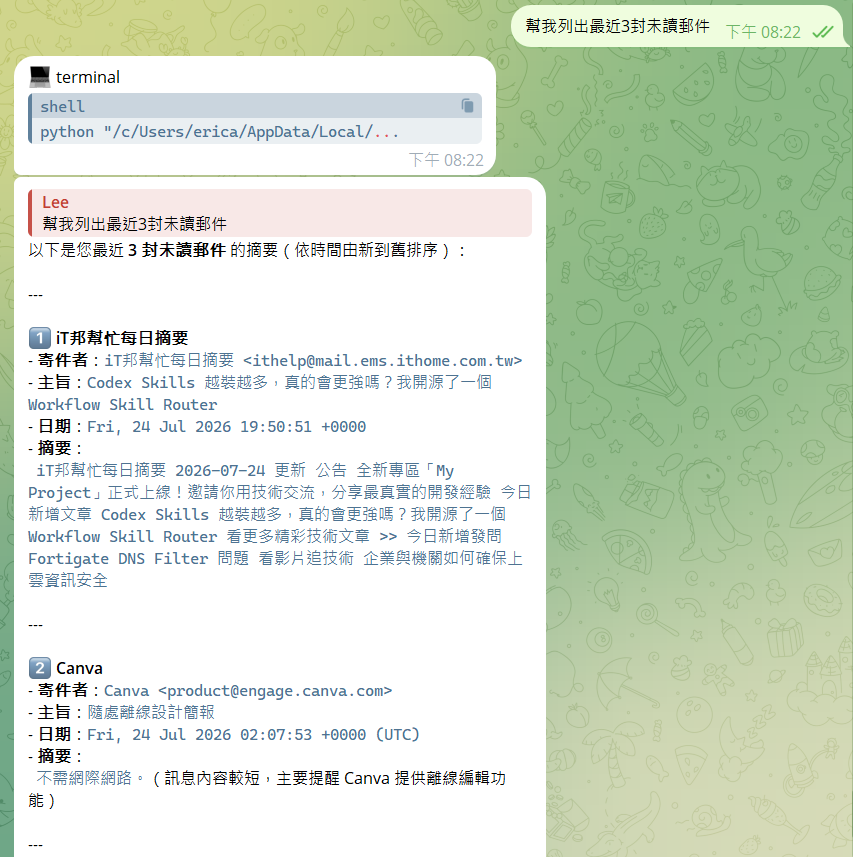

### 1.2 Google Calendar:

- **測試目的**：確認AI Agent是否能新增日曆行程。
- **Prompt**：
  ```text
  幫我新增一個行程：
  名稱：台中旅遊
  開始時間：2026/07/30 上午 9:00
  結束時間：2026/08/02 下午 6:00
  ```
> **執行成果**

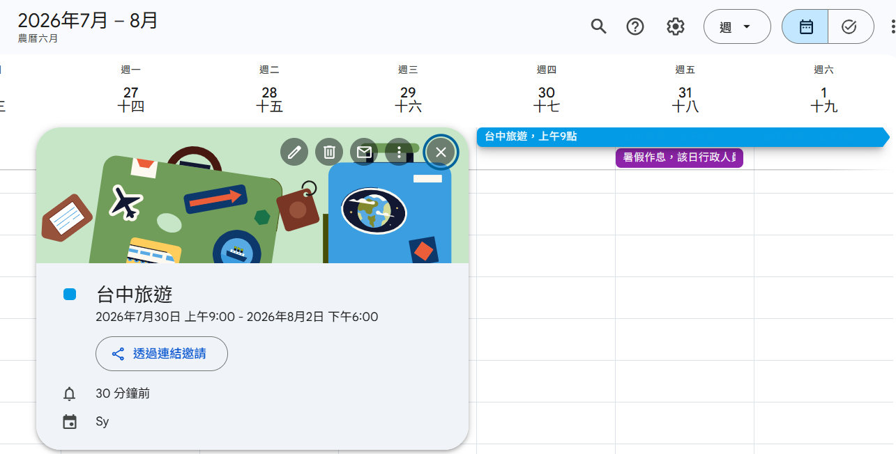

### 1.3 Google Drive:

- **測試目的**：確認AI Agent是否能搜尋雲端硬碟中的檔案。
- **Prompt**：
   ```text
   幫我搜尋名稱包含「期中考」的檔案
   ```
> **執行成果**

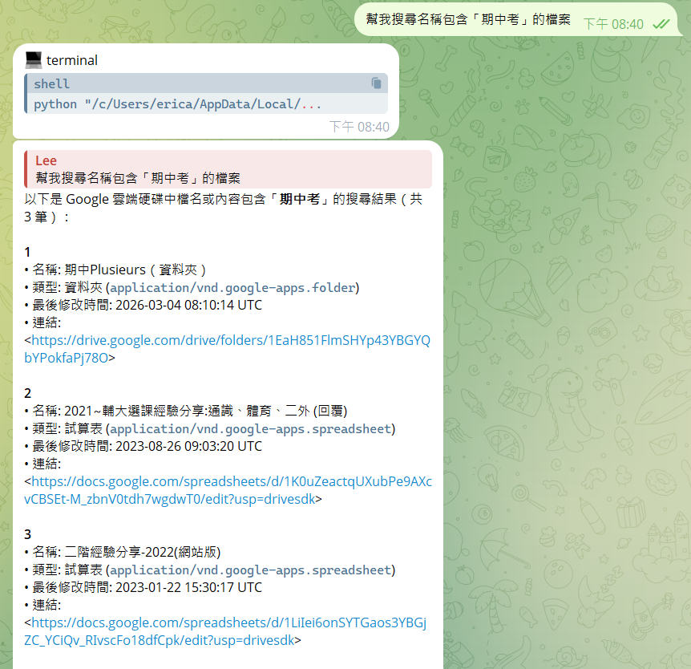

### 1.4 Google Docs:

- **測試目的**：確認AI Agent是否能建立新文件並寫入指定內容。

- **Prompt**：
   ```text
   建立一份名為「每日待辦事項」的文件，內容包含：
   1. 學習 Figma
   2. 練習 AI Agent
   3. 完成 GitHub 文件
   ```
> **執行成果**

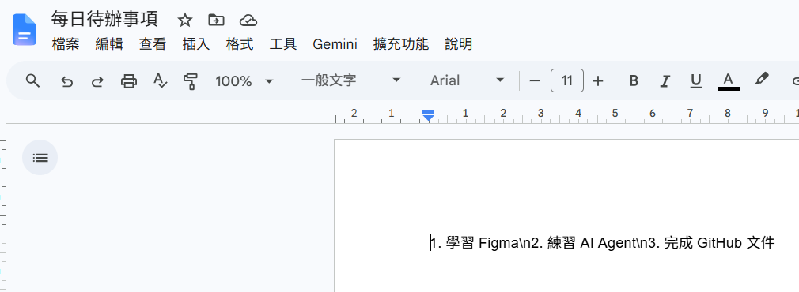

## 2. Study Planner
建立Study Planner Skill，使AI Agent能:

- 收集本週讀書科目、作業、考試與可讀書時間
- 整理待辦事項
- 依截止日期安排優先順序
- 自動產生一週讀書計畫
- 整理本週完成與未完成事項
- （可選）建立Google Calendar、Google Docs與Google sheet

完整Prompt請參考:
docs/study-planner-prompt.md

- **測試目的** : 確認AI Agent能依照使用者提供的資訊，主動規劃一週讀書計畫

- **Prompt**：
   ```text
   請幫我安排這週的讀書計畫
   ```
- **執行流程**

 ```mermaid
flowchart TD
    A[開始] --> B[使用者輸入：安排這週讀書計畫]
    B --> C[詢問課程、作業、考試資訊]
    C --> D[詢問每天可讀書時間]
    D --> E[整理待辦事項]
    E --> F[依截止日期排序]
    F --> G[安排每日讀書計畫]
    G --> H[產生本週讀書進度表]
    H --> I{是否建立Google Workspace?}
    I -->|Google Calendar| J[建立Google Calendar行程]
    I -->|Google Docs| K[建立Google Docs文件]
    I -->|Google Sheet| L[建立Google Sheet試算表]
    J --> M[完成]
    K --> M
    L --> M
```

- **執行成果**

> **對話**
  
   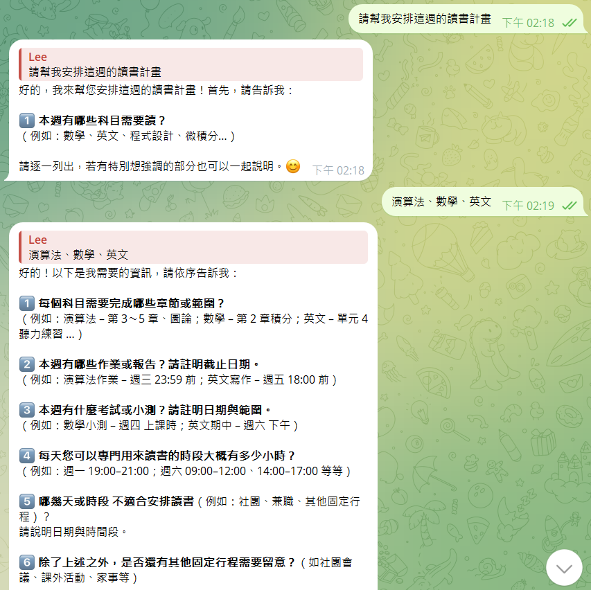


> **產生結果**
  
   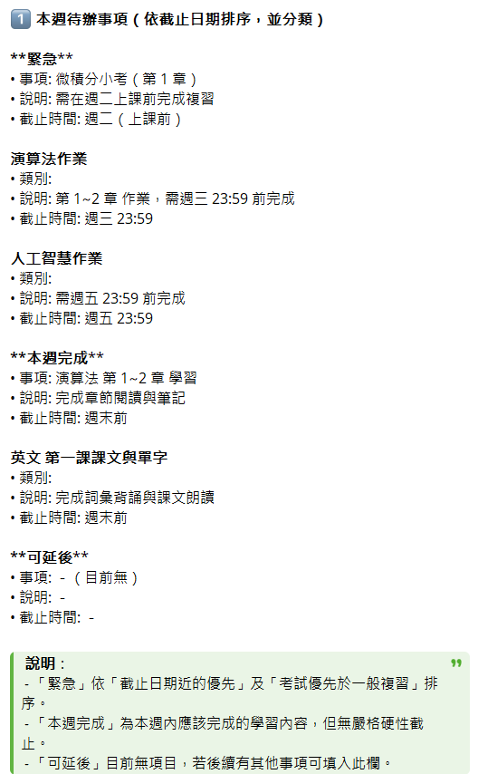
   

> **Calendar、Docs建立**
  
   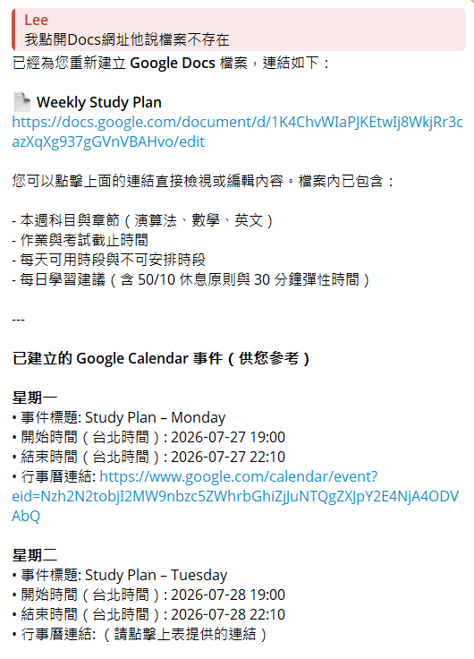

> **Sheet建立**

   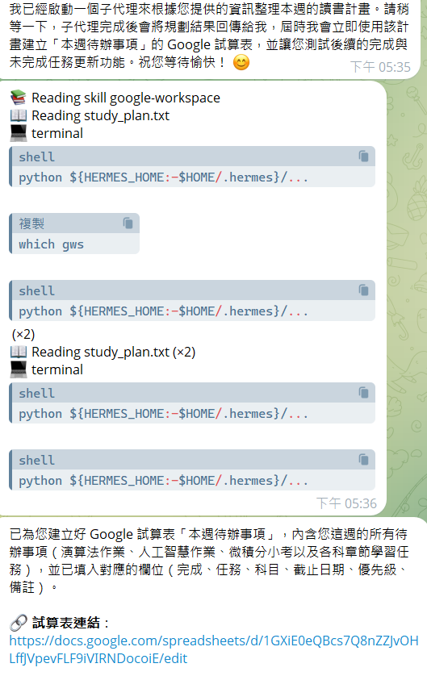

## 3. Project Planner

建立Project Planner S，使AI Agent能:

- 收集專題相關資訊(專題名稱、時程、組員、目標)
- 拆解專題Milestone
- 自動安排每周工作目標
- 產生專題甘特圖
- 追蹤專題開發進度
- 整理已完成、進行中、未開始及延期工作
- (可選)建立Google Calendar、Google Docs與Google Sheets

完整Prompt請參考:
docs/project-planner-prompt.md

- **測試目的**: 確認AI Agent能依照使用者提供的專題資訊，自動規劃完整的專題開發流程與進度管理

- **Prompt**：
   ```text
   請幫我規畫專題
   ```
- **執行流程**

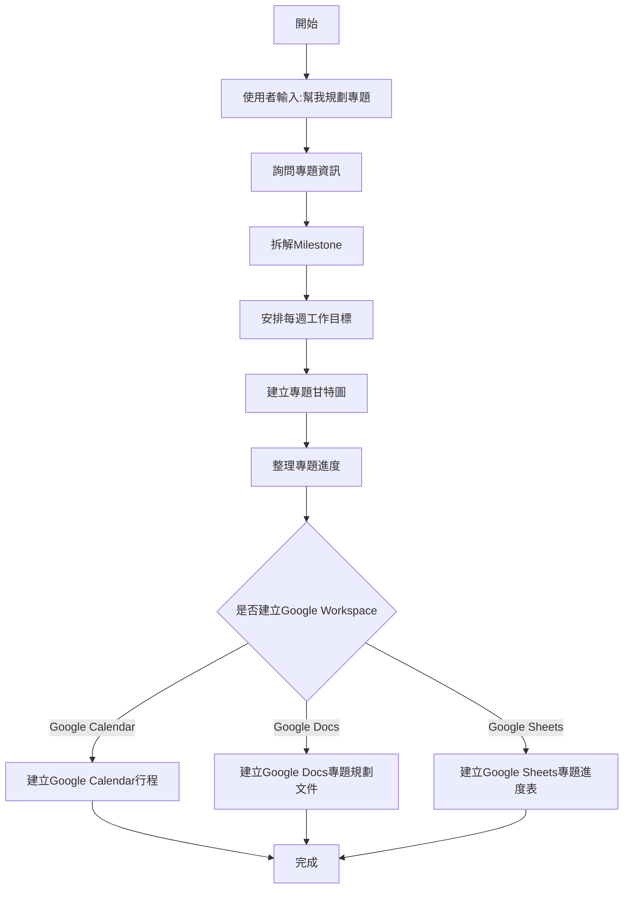
- **執行成果**

> **對話**

 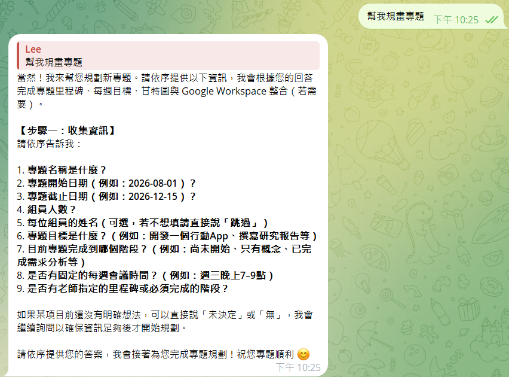
 
> **產生結果**
  
  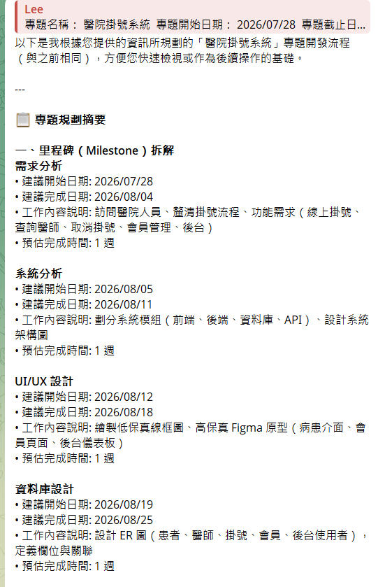
  
> **額外功能建立**
  
  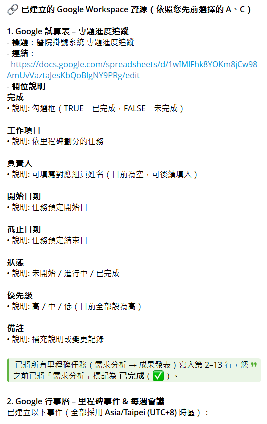


