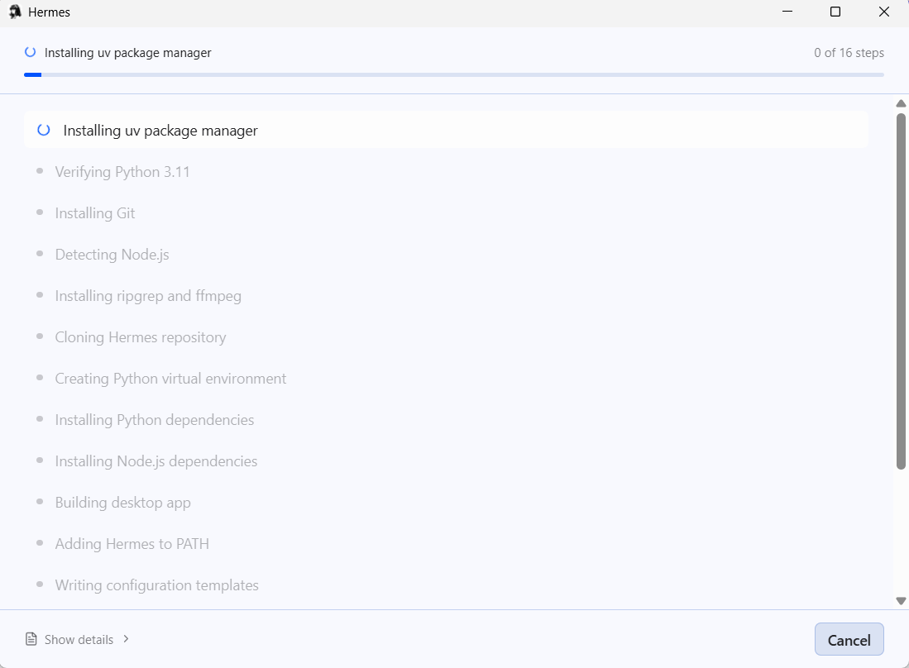
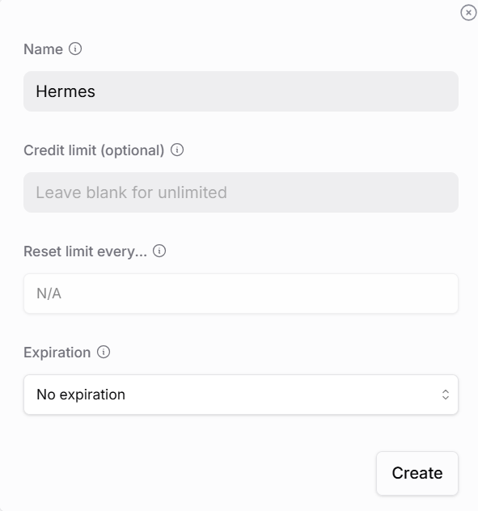
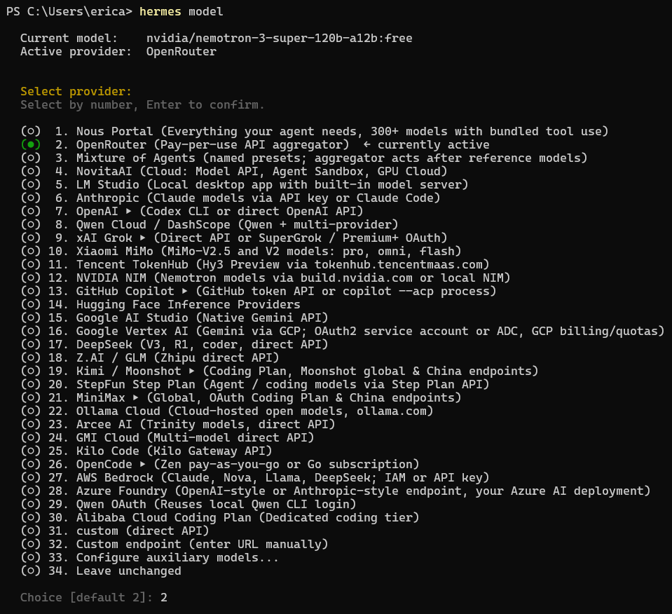
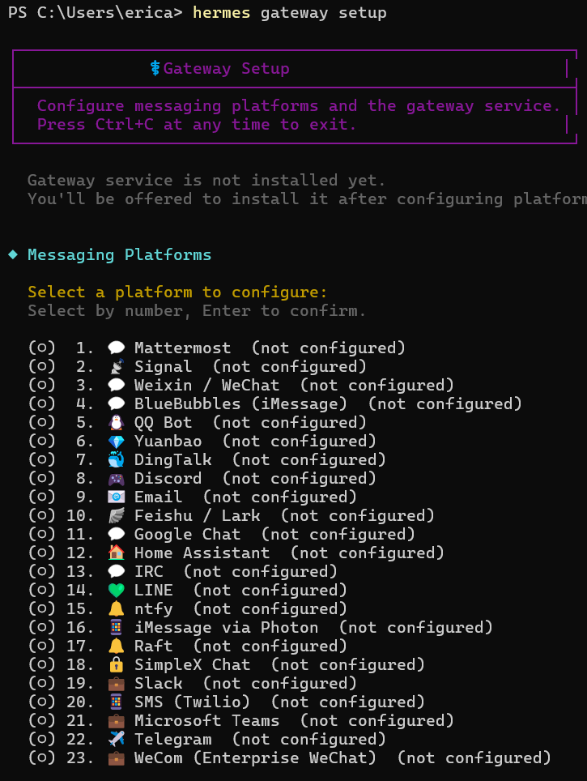
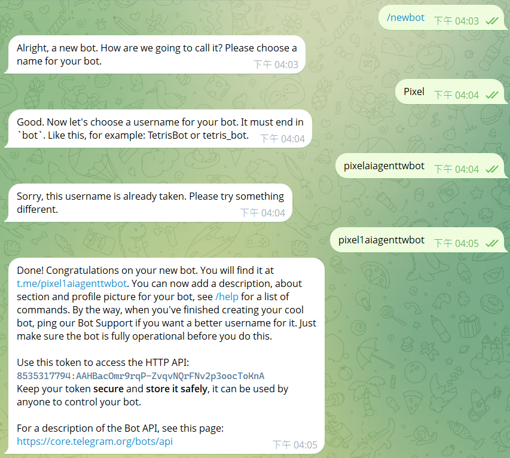
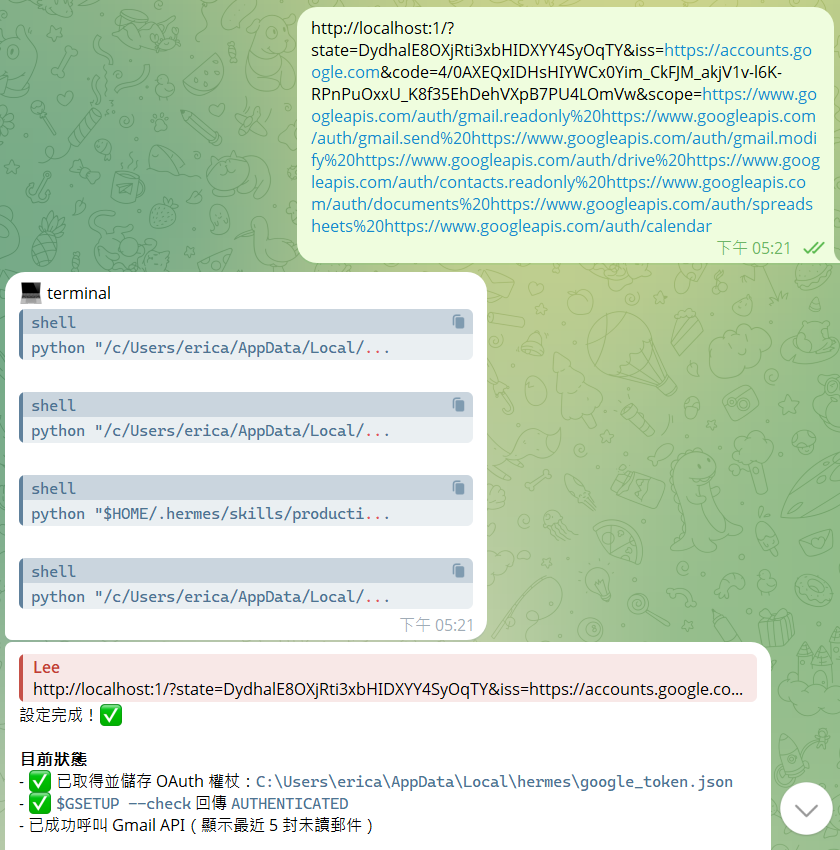

# Installation Guide
本文件說明如何建立Hermes AI Agent環境，
包含Hermes安裝、OpenRouter API、Telegram串接和Telegram Bot建立。
## 1.安裝Hermes
前往Hermes官方網站下載並完成安裝。

完成安裝後，可看到安裝成功畫面：

## 2.設定OpenRouter API 
OpenRouter作為LLM API Gateway，
讓Hermes可以連接不同的大型語言模型。

操作流程：
1. 建立 OpenRouter 帳戶
2. 建立 API Key
3. 將 API Key 提供給 Hermes 使用
完成後，可以看到API建立頁面:

## 3.串接OpenRouter
在終端機輸入hermes model

接著選擇OpenRouter，並輸入API Key完成模型設定。

完成後，可看到成功串接畫面:

## 4.串接Telegram
在終端機輸入hermes gateway setup

選擇telegram作為Gateway。

完成設定後，AI Agent可以透過Telegram與使用者互動

完成設定畫面:

## 5.建立Telegram Bot
使用Telegram的BotFather建立Bot。

設定:
- Bot名稱
- Username

將授權碼貼回終端機，即可與Bot對話。

建立完成圖片:

## 6.串接Google Workspace
依照Hermes提供的指引，在Google Cloud建立專案並啟用所需的Google Workspace API。

啟用項目:
- Gmail API
- Google Calendar API
- Google Drive API
- Google Docs API

完成API啟用後，建立OAuth用戶端憑證，並下載憑證JSON檔

最後將JSON憑證檔提供給Hermes，完成Google Workspace串接。

完成OAuth驗證後，可使用Gmail、Google Calendar、Google Drive及Google Docs等功能進行操作。

完成串接畫面:

## Installation Verification

完成以上設定後，可以確認:
- Hermes已成功安裝
- OpenRouter已完成串接
- Telegram已完成串接
- Telegram Bot已建立完成
- Google Workspace已完成串接

接下來即可開始測試AI Agent功能。

